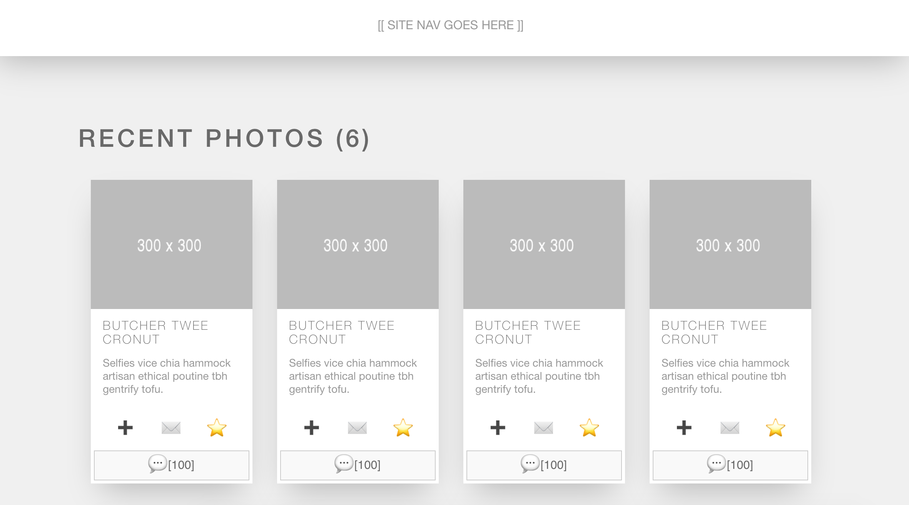

# React Parent-Child Lab: Build-a-Blog

In this lab, you'll "componentize" a website mockup.

## Getting Started

1. Clone this repository using `git clone`
2. `cd` into the `react-parent-child-lab` folder
3. `npm install`
4. `npm start`

## The Goal

A designer at your agency has provided you with a mockup for a redesigned news site homepage. They were going for something that is part Instagram, part Facebook, part Medium.

For now, the team isn't worried about showing actual text in the mockup, so they've used some dummy text from [Hipster ipsum](https://hipsum.co/) and some placeholder images from [placeholder.com](https://placeholder.com/). Once everyone agrees on the layout, the developers and the backend database team will work on passing real text and images into the layout.

## The Lab

Your task is to convert the HTML code in `App.js` into functional components.

As you divide up the HTML mockup into components, here are a few things you'll want to remember:

- Remember to export the function from the component file (the child).
- Remember to import the child function into the appropriate parent component file.
- There's alread a component called `example.js` stored in the subdirectory called `components/`. You can store all your components there (recommended), or you can make a more complex file structure. You'll probably want to use better file names and better component names than "example", but the specific names are up to you.
- It is best practice to make the component name consistent throughout. So whatever name you use after `const` should also be the name of the file. It's easier to keep track of which component belongs to which file this way.

You can go about this process of breaking HTML out into components in whatever way you find easiest, but here are a few tips to help you get started:

- Look for repeated sub-units. If something is repeated, then it will probably benefit from being a child component to some parent element.
- Look for smaller and smaller sub-units that might be used in various different units. Try to be as efficient as possible so you're not creating two child components that return the exact same code.
- Consider using semantic (or meaningful) names for your components so another developer could inspect your code and understand the overall structure of the app.

## Extensions

Once the page is fully "componentized", it's time to add some content.

1. Add props to the components you used for recent photos, but bear in mind that adding titles and descriptions is a better starting point than photos.

2. Instead of passing individual props, wrap them up in an array, object, or more complex JSON structure, and then use `.map()` to make this more seamless.

3. The number of recent photos, recent articles, and recent comments are all hard-coded in right now. Use some JavaScript to populate those fields responsively. 
